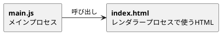

# sample_electron
## 開発環境
- Windows10 version 1909
- npm version 6.14.4
- electron version 20.0.2
- electron-packager version 15.5.1

## Electronとは？
javascript等のウェブ技術でデスクトップアプリケーションを作成できるフレームワーク。

## Electronを使った文字を表示するだけのアプリ作成
0. モジュール構成図

1. node.jsのインストール（未インストールの場合のみ）
2. Projectの作成
   今回は`sample_electron`というディレクトリを作成。
   そのディレクトリ直下で、npm初期設定。
   ```
   npm init
   ```
3. Electronのインストール
   下記コマンドでElectronのモジュールをインストール。バージョン問題が出ないよう、一応グローバルではなくプロジェクト単位でのインストール。少し時間がかかります。
   ```
   npm install -D electron
   ```
4. ソースファイルの作成
   ソースとして必要なのは最低限下記3つ。
   - package.json : Electron実行に必要な設定ファイル。
   - main.js : アプリケーションのエントリーポイント。
   - index.html : メインウィンドウとして開くソース。
   ※この他、レンダラープロセスの前に読み込むことができるpreload等もあり。レンダラープロセスからは直接Electronのメソッドを実行することができないため通常はプロセス間通信（IPC）を使ってメインプロセスにリクエストを投げ、ElectronのメソッドやNode.jsのメソッドを使うことになるが、アプリの立ち上げ時だけこれらのメソッドを使いたい場合などにはこのpreloadのファイルに記述しておくことでIPCなしにこれらのメソッドを使用することができる。


   今回は最低限の内容で下記のようなソースにした。

   ▼`package.json`
   ```json package.json
   {
      "main": "main.js"
   }
   ```
   ▼`main.js`
   ```js main.js
      // アプリケーション作成用のモジュールを読み込み
    const { app, BrowserWindow } = require("electron");

    // メインウィンドウ
    let mainWindow = null;

    const createWindow = () => {
      // メインウィンドウを作成
      mainWindow = new BrowserWindow({ width: 800, height: 600 });
      // メインウィンドウに表示するHTMLを指定
      mainWindow.loadFile("index.html");
      // Chromiumのディベロッパーツールの起動
      mainWindow.webContents.openDevTools();
      // メインウィンドウが閉じられた時の処理
      mainWindow.on("close", () => {
        mainWindow = null;
      });
    }

    // アプリケーションの初期化が完了した時の処理
    app.on("ready", () => {
      createWindow();
    });

    // 全てのウィンドウが閉じられた時
    app.on("window-all-closed", () => {
      // macos以外はアプリケーションを終了させる
      if (process.platform !== "darwin") {
        app.quit();
      }
    });
   ```
   ▼`index.html`
   ```html index.html
   <!DOCTYPE html>
    <html lang="ja">

    <head>
      <meta charset="UTF-8">
      <meta http-equiv="X-UA-Compatible" content="IE=edge">
      <meta name="viewport" content="width=device-width, initial-scale=1.0">
      <title>Test Electron</title>
    </head>

    <body>
      <H1>Test Electron!!</H1>
    </body>

    </html>
   ```
5. アプリケーションの実行
   プロジェクトのルートディレクトリ（今回でいえば`/sample_electron`）で下記コマンドを実行する。
   `npx`はnpmバージョン5.2.0から同梱されているモジュールで、ローカルインストールしたコマンドを実行するために使われる。なお、npxコマンド実行が実行されるとローカル内で指定されたNodeモジュール格納パスの探しに行き、見つからない場合はインターネット上から探して自動的にインストールし、実行したNodeモジュールは実行後に自動削除される。
   ```
   npx electron ./src
   ```
   もしくは、プロジェクトのルートディレクトリの`package.json`内のscriptsを下記のように修正。
   ```json
   "scripts": {
      "start": "node_modules/.bin/electron ./src"
    }
   ```
   そのうえで、下記コマンドで実行。
   ```
   npm run start
   ```
6. パッケージング
   他人へアプリとして配布する際などに`.exe`や`.app`にパッケージングする必要がある。
   パッケージングには`electron-packager`というモジュールを使用。最近はより高度な`electron-builder`というモジュールを使用するのが主流らしいが、なぜか私の環境ではうまく動作せず。
   まずは`electron-packager`をインストール。この時、`devDependencies`としてインストール以内とパッケージングの際にエラーになるらしいので、`-D`を忘れないこと。
   ```
   npm install -D electron-packager
   ```
   その後、下記コマンドでWindows用exeファイルを作成。これは「srcというディレクトリに入っているソースコードをFirstAppというアプリケーション名で64ビット向けにパッケージングし、2回目以降は上書きを行う」という命令らしいです。[最新版で学ぶElectron入門] 参照。

   ```
   npx electron-packager src FirstApp --platform=win32 --arch=x64 --overwrite
   ```
   コマンド実行後、`FirstApp-win32-x64`というフォルダが作成され、この中にexeファイルおよび関連ファイルが作成されます。配布時はこのフォルダごとzipで配布すればOK。（electron-builderを使用するとインストーラーでの配布が可能なようです。）

## 参考ページ
[最新版で学ぶElectron入門]
[Electronデスクトップアプリ開発入門（1）]
[npxコマンドとは？ 何ができるのか？]
[electron-builderについて]

[最新版で学ぶElectron入門]:https://ics.media/entry/7298/
[Electronデスクトップアプリ開発入門（1）]:https://www.buildinsider.net/enterprise/electron/01
[npxコマンドとは？ 何ができるのか？]:https://zenn.dev/ryuu/articles/what-npxcommand
[electron-builderについて]:https://qiita.com/saki-engineering/items/203892838e15b3dbd300